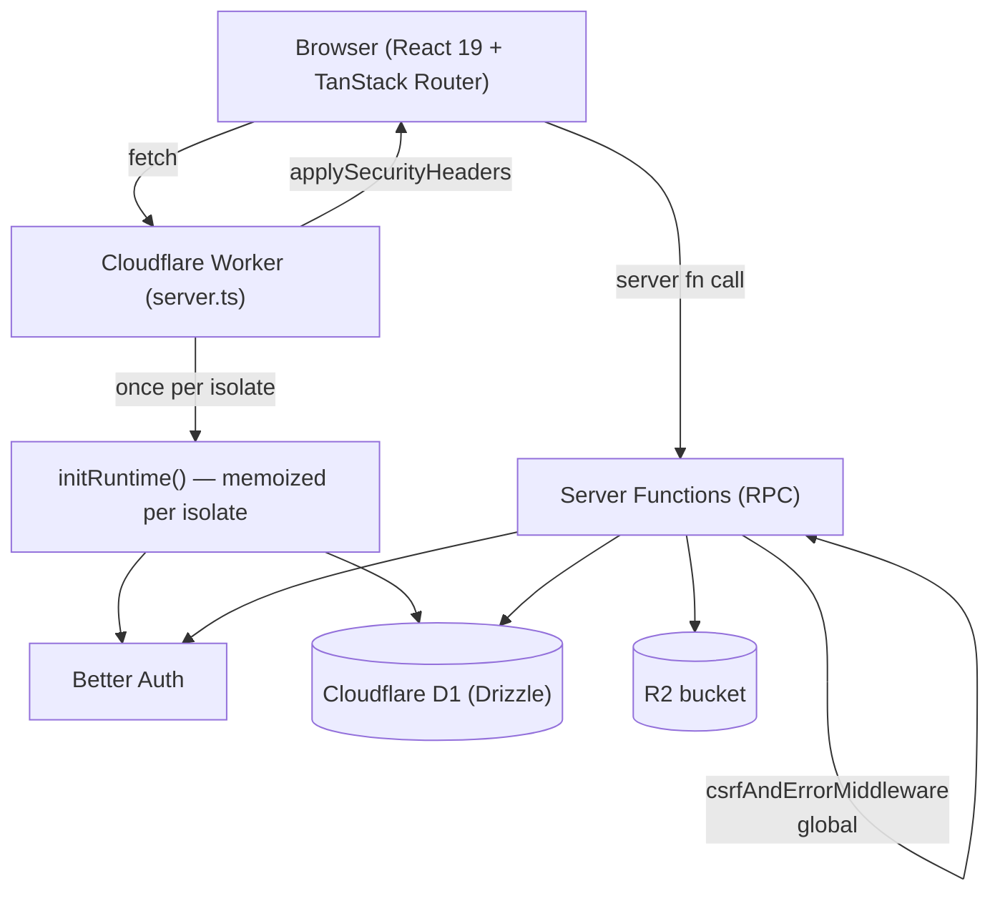

# Architecture

A pnpm monorepo: a TanStack Start app on Cloudflare Workers, a shared data package,
and an optional background/API worker.

## Request flow

## Boot sequence (per worker isolate)

1. `server.ts` receives the request, calls `initRuntime(env)`.
2. `initRuntime` (memoized) validates env (`core/env.ts`), builds the Drizzle DB
   (`createDatabase`) and Better Auth (`createAuth`), and populates the legacy
   `getDb()`/`getAuth()` singletons. Built **once**, reused for every later request.
3. The request is handled by TanStack Start; `applySecurityHeaders` wraps the response.

## Where things live

| Concern | Location |
| --- | --- |
| Routes (file-based) | `apps/user-application/src/routes/` |
| Server functions (RPC) | `apps/user-application/src/core/functions/` |
| Global server-fn middleware (CSRF/error) | registered in `src/start.ts` |
| Runtime boot (db/auth/env) | `src/core/runtime.ts`, `src/core/env.ts` |
| Auth config | `packages/data-ops/src/auth/server.ts` |
| DB schema + migrations | `packages/data-ops/src/drizzle/` |
| Reusable DB queries | `packages/data-ops/src/queries/` |
| Validation schemas | `packages/data-ops/src/zod-schema/` |
| UI primitives (shadcn) | `apps/user-application/src/components/ui/` |
| i18n | `apps/user-application/src/i18n/` |
| Security (headers, rate limit) | `apps/user-application/src/core/security/` |
| Email shell + HTML templates | `apps/user-application/src/core/email/` |
| Empty / error / loading states | `components/ui/empty-state.tsx`, `components/ui/skeleton.tsx` |
| Dashboard layout (sidebar + header) | `routes/dashboard/route.tsx`, `components/layout/app-sidebar.tsx` (shadcn `Sidebar`, responsive via Sheet) |
| Background jobs + REST API | `apps/data-service/` |

## Pages

| Route | Purpose | Auth |
| --- | --- | --- |
| `/` | Marketing landing + feature guide | public |
| `/showcase` | Live component + capability gallery | public |
| `/todos` | Mock form example | public |
| `/sitemap.xml` | Dynamic sitemap | public |
| `/login` | Sign in (platform admin) | public |
| `/$organizationSlug/login` | Org login | public |
| `/$organizationSlug/app` | Organization workspace shell | org member |
| `/dashboard` | Admin dashboard shell | platform admin |
| `/dashboard/account` | Profile + change password + sign out | platform admin |
| `/dashboard/settings` | Site settings + Open Graph editor | platform admin |
| `/dashboard/organizations` | Organization management | platform admin |
| `/health`, `/ready` | Liveness / readiness probes | public |
| `/api/auth/$` | Better Auth handler (rate-limited) | — |

## Two ways the backend is reachable

- **Server functions** (`createServerFn`) — typed RPC for THIS app's own frontend. Default path.
- **REST API** (`apps/data-service` `/api/v1`, OpenAPI at `/docs`) — for external callers
  (mobile, partners, webhooks).

## Key conventions

- **No hardcoded UI strings** — everything goes through i18next `t()`. Enforced by ESLint.
- **Auth is explicit** — server functions call `requireOrganizationContext` /
  `requirePermission`. The one public function (`getOrganizationBySlugFn`) is documented as such.
- **Env is validated on boot** — missing secrets crash loudly, not deep in a request.
