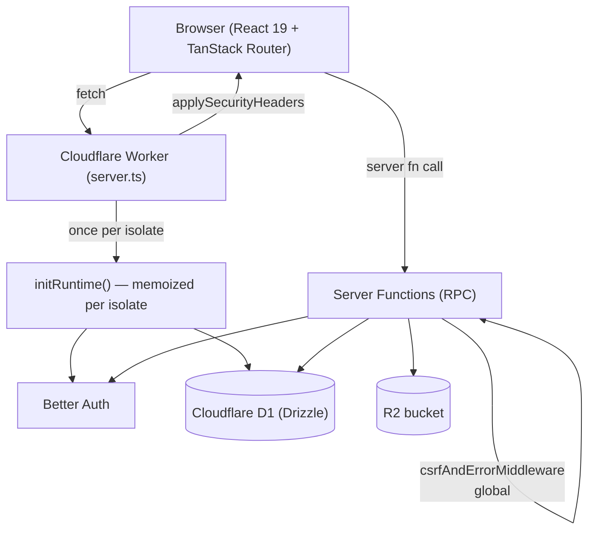

# Architecture

A pnpm monorepo: a TanStack Start app on Cloudflare Workers, a shared data package,
and an optional background/API worker.

## Request flow

```mermaid
flowchart TD
    Browser["Browser (React 19 + TanStack Router)"]
    Worker["Cloudflare Worker (server.ts)"]
    Runtime["initRuntime() — memoized per isolate"]
    Auth["Better Auth"]
    DB[("Cloudflare D1 (Drizzle)")]
    R2[("R2 bucket")]
    SF["Server Functions (RPC)"]

    Browser -->|fetch| Worker
    Worker -->|once per isolate| Runtime
    Runtime --> Auth
    Runtime --> DB
    Worker -->|applySecurityHeaders| Browser
    Browser -->|server fn call| SF
    SF -->|csrfAndErrorMiddleware<br/>global| SF
    SF --> DB
    SF --> R2
    SF --> Auth
```

## Boot sequence (per worker isolate)

1. `server.ts` receives the request, calls `initRuntime(env)`.
2. `initRuntime` (memoized) validates env (`core/env.ts`), builds the Drizzle DB
   (`createDatabase`) and Better Auth (`createAuth`), and populates the legacy
   `getDb()`/`getAuth()` singletons. Built **once**, reused for every later request.
3. The request is handled by TanStack Start; `applySecurityHeaders` wraps the response.

## Where things live

| Concern                                  | Location                                                                                                   |
| ---------------------------------------- | ---------------------------------------------------------------------------------------------------------- |
| Routes (file-based)                      | `apps/user-application/src/routes/`                                                                        |
| Server functions (RPC)                   | `apps/user-application/src/core/functions/`                                                                |
| Global server-fn middleware (CSRF/error) | registered in `src/start.ts`                                                                               |
| Runtime boot (db/auth/env)               | `src/core/runtime.ts`, `src/core/env.ts`                                                                   |
| Auth config & RBAC rules                 | `packages/data-ops/src/auth/server.ts`, `packages/data-ops/src/auth/access-control.ts`                     |
| Client RBAC Provider & Gates             | `apps/user-application/src/components/auth/rbac.tsx` (`<Can>`, `<RoleGate>`)                               |
| DB schema + migrations                   | `packages/data-ops/src/drizzle/`                                                                           |
| Reusable DB queries                      | `packages/data-ops/src/queries/`                                                                           |
| Validation schemas (shared)              | `packages/data-ops/src/zod-schema/`                                                                        |
| UI primitives (shadcn)                   | `apps/user-application/src/components/ui/`                                                                 |
| In-app feedback & bug reporter           | `components/feedback/feedback-dialog.tsx`, `core/functions/feedback.ts`                                    |
| Payment Gateways (Midtrans & DOKU)       | `core/payments/` (AES-GCM `secret-box`, webhooks, gateway adapters)                                        |
| Legal & Cookie Compliance                | `routes/terms.tsx`, `routes/privacy.tsx`, `components/legal/cookie-consent.tsx`                            |
| SEO & Crawler controls                   | `routes/robots[.]txt.tsx`, `routes/sitemap[.]xml.tsx`, `utils/seo.ts`                                      |
| i18n                                     | `apps/user-application/src/i18n/`                                                                          |
| Security (headers, rate limit)           | `apps/user-application/src/core/security/`                                                                 |
| Email shell + HTML templates             | `apps/user-application/src/core/email/`                                                                    |
| Empty / error / loading states           | `components/ui/empty-state.tsx`, `components/ui/skeleton.tsx`                                              |
| Dashboard layout (sidebar + header)      | `routes/dashboard/route.tsx`, `components/layout/app-sidebar.tsx` (shadcn `Sidebar`, responsive via Sheet) |
| Background jobs + REST API               | `apps/data-service/`                                                                                       |

## Pages

| Route                          | Purpose                                                          | Auth           |
| ------------------------------ | ---------------------------------------------------------------- | -------------- |
| `/`                            | Marketing landing + feature guide                                | public         |
| `/showcase`                    | Live component + capability gallery                              | public         |
| `/todos`                       | Mock form example                                                | public         |
| `/terms`                       | Terms of Service & acceptable use agreement                      | public         |
| `/privacy`                     | Privacy policy (GDPR & CCPA edge disclosures)                    | public         |
| `/robots.txt`                  | Crawler rules (protects internal routes)                         | public         |
| `/sitemap.xml`                 | Dynamic search-engine sitemap with priorities                    | public         |
| `/login`                       | Sign in (platform admins → `/dashboard`, others → `/onboarding`) | public         |
| `/signup`                      | Self-serve account sign-up                                       | public         |
| `/onboarding`                  | Pick one of your orgs or create one (you become owner)           | signed in      |
| `/$organizationSlug/login`     | Org login                                                        | public         |
| `/$organizationSlug/dashboard` | Organization workspace shell (RBAC-aware)                        | org member     |
| `/dashboard`                   | Admin dashboard shell                                            | platform admin |
| `/dashboard/account`           | Profile + change password + sign out                             | platform admin |
| `/dashboard/settings`          | Site settings + Open Graph editor                                | platform admin |
| `/dashboard/organizations`     | Organization oversight (list, status)                            | platform admin |
| `/health`, `/ready`            | Liveness / readiness probes                                      | public         |
| `/api/auth/$`                  | Better Auth handler (rate-limited)                               | —              |

## Two ways the backend is reachable

- **Server functions** (`createServerFn`) — typed RPC for THIS app's own frontend. Default path.
- **REST API** (`apps/data-service` `/api/v1`, OpenAPI at `/docs`) — for external callers
  (mobile, partners, webhooks).

## Key conventions

- **No hardcoded UI strings** — everything goes through i18next `t()`. Enforced by ESLint.
- **Auth is explicit** — server functions call `requireOrganizationContext` (membership-checked) /
  `requirePermission` (role-checked). The workspace route re-checks membership in `beforeLoad`. The one public function (`getOrganizationBySlugFn`) is documented as such.
- **Env is validated on boot** — missing secrets crash loudly, not deep in a request.
